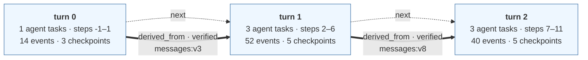

# Episode — tau2_task39_qwen14b_clean.jsonl

episode `tau2-39-7e8e66` · thread `tau2-39-7e8e66` · 3 turns
τ² task 39 · model openai · outcome PASSED · faults none

```
EpisodeGraph
  └── TurnGraph
        └── TaskRun
              └── Event
```

A turn is a Firebreak-assigned analysis unit, stamped by whoever recorded the run. By convention one external interaction is recorded as one turn, but nothing enforces that. `step` is LangGraph's super-step counter for the whole thread, so a turn's steps do not start at zero and one step can hold several task runs.

## Episode

| turn | invokes | steps | agent tasks | events | checkpoints | wall time |
|---|---|---|---|---|---|---|
| 0 | 1 | -1–1 | 1 | 14 | 3 | 1.4s |
| 1 | 1 | 2–6 | 3 | 52 | 5 | 18.1s |
| 2 | 1 | 7–11 | 3 | 40 | 5 | 18.2s |

The dotted `next` arrows are recording order, not causality. The 2 thick arrows are relations that actually cross a turn boundary.



### Relations that cross a turn boundary

| kind | from turn | to turn | carrier | evidence |
|---|---|---|---|---|
| `derived_from` (verified) | 0 | 1 | `messages:v3` | element ids recorded per version |
| `derived_from` (verified) | 1 | 2 | `messages:v8` | element ids recorded per version |

## Turn 0

1 agent task runs (`supervisor@1`), 1 internal, 3 state versions, 3 WRITE · 1 READ · 1 TRIGGER · 1 DERIVED_FROM, 0 in / 1 out across the boundary.


## Turn 1

3 agent task runs (`supervisor@4`, `lookup@5`, `supervisor@6`), 1 internal, 7 state versions, 7 WRITE · 3 READ · 3 TRIGGER · 3 DERIVED_FROM, 1 in / 1 out across the boundary.


## Turn 2

3 agent task runs (`supervisor@9`, `booking@10`, `supervisor@11`), 1 internal, 7 state versions, 7 WRITE · 3 READ · 3 TRIGGER · 3 DERIVED_FROM, 1 in / 0 out across the boundary.


---

Relation-level evidence and the field each relation came from are in the `.provenance.txt` and `.provenance.md` beside this file.
