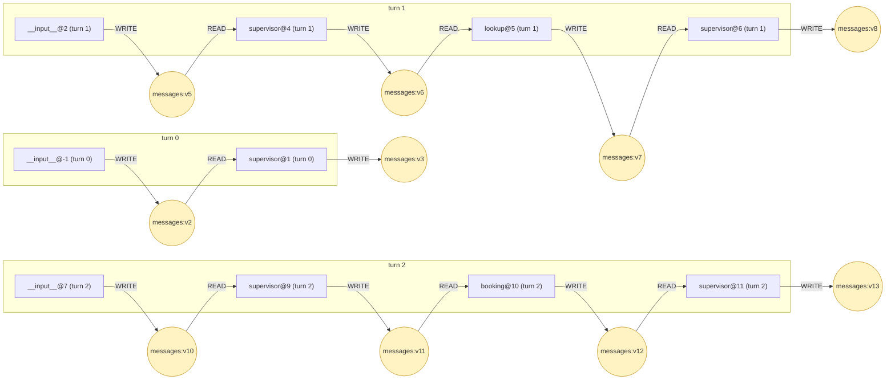
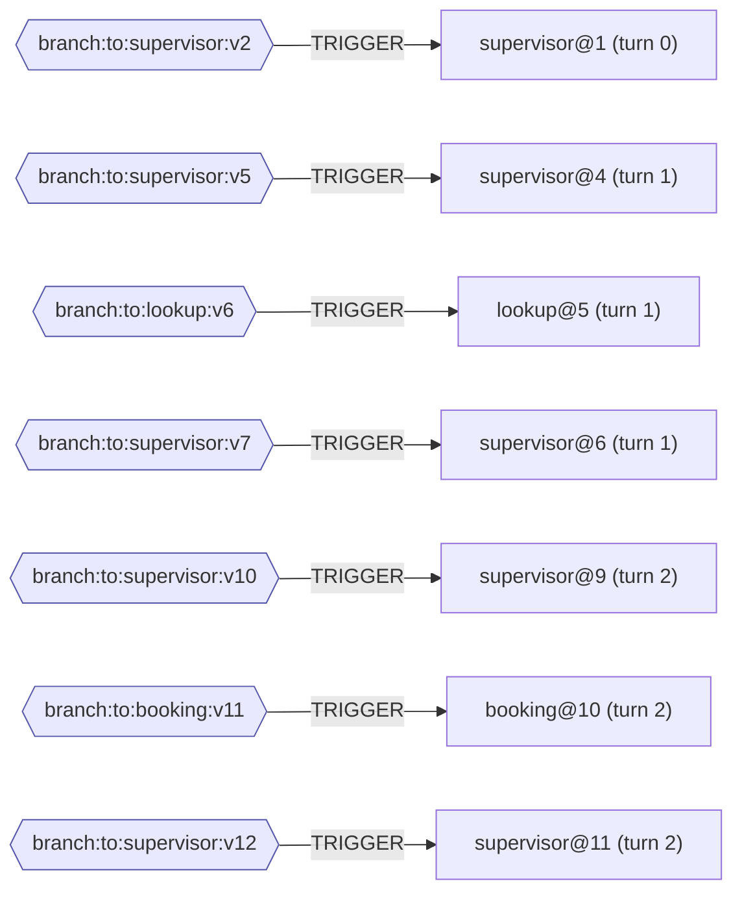

# Provenance — tau2_task39_qwen14b_clean.jsonl

τ² task 39 · model openai · outcome PASSED · faults none

10 task runs · 17 state versions · 17 WRITE · 7 READ · 7 TRIGGER · 9 DERIVED_FROM

Three relations, three pictures. They answer different questions, so they are not merged.

| diagram | relation | question |
|---|---|---|
| Data flow | `WRITE` / `READ` | which task produced the value another task was handed |
| State lineage | `DERIVED_FROM` | whether a later version of a channel still contains an earlier one |
| Control flow | `TRIGGER` | what caused each task to be scheduled |

## Data flow

Channels the data travelled on: `messages`. Both relations are **observed**: the write comes from the checkpoint's `pending_writes`, the read from the `channel_versions` of the checkpoint the task was scheduled from, intersected with the channels its recorded input carried.

## State lineage

A folding channel merges each write into the value rather than replacing it, which does **not** mean the new version contains the old one. Each link is checked against the element identities recorded per version: **9 verified, 0 refuted, 0 unverified**. Only verified links may be followed when tracing accumulation.

```mermaid
flowchart LR
  s_messages_v2(("messages:v2"))
  s_messages_v3(("messages:v3"))
  s_messages_v5(("messages:v5"))
  s_messages_v6(("messages:v6"))
  s_messages_v7(("messages:v7"))
  s_messages_v8(("messages:v8"))
  s_messages_v10(("messages:v10"))
  s_messages_v11(("messages:v11"))
  s_messages_v12(("messages:v12"))
  s_messages_v13(("messages:v13"))
  s_messages_v2 -. verified · kept 1 .-> s_messages_v3
  s_messages_v3 -. verified · kept 2 .-> s_messages_v5
  s_messages_v5 -. verified · kept 3 .-> s_messages_v6
  s_messages_v6 -. verified · kept 4 .-> s_messages_v7
  s_messages_v7 -. verified · kept 5 .-> s_messages_v8
  s_messages_v8 -. verified · kept 6 .-> s_messages_v10
  s_messages_v10 -. verified · kept 7 .-> s_messages_v11
  s_messages_v11 -. verified · kept 8 .-> s_messages_v12
  s_messages_v12 -. verified · kept 9 .-> s_messages_v13
  classDef state fill:#fff3c4,stroke:#b8860b;
  class s_messages_v2,s_messages_v3,s_messages_v5,s_messages_v6,s_messages_v7,s_messages_v8,s_messages_v10,s_messages_v11,s_messages_v12,s_messages_v13 state;
```

## Control flow

Routing channels: `branch:to:booking, branch:to:lookup, branch:to:supervisor`. LangGraph stamps `versions_seen` only for a task's trigger channels, so in a `StateGraph` this records the routing channel and never the channel the data travelled on. That is why control and data are separate pictures rather than two edge types in one.

---

Every relation and the field it came from are in the `.provenance.txt` beside this file; the machine-readable form is in the `.provenance.json`.
