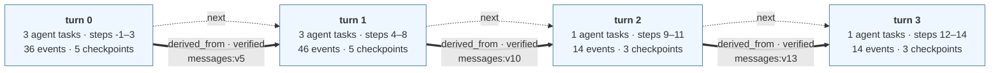
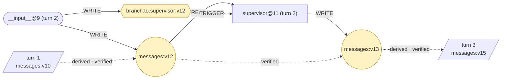
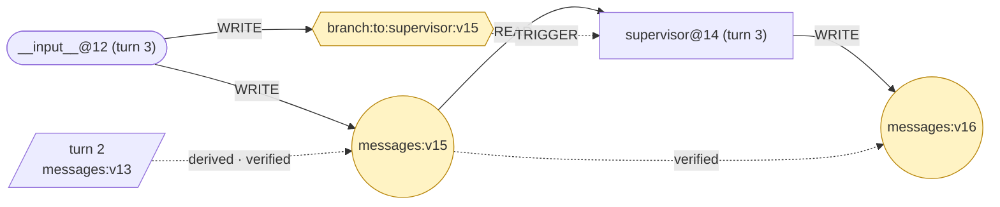

# Episode — trace.jsonl

episode `tau2-0-afe836` · thread `tau2-0-afe836` · 4 turns
τ² task 0 · model openai · outcome PASSED · faults none

### Evaluation

| | |
|---|---|
| Outcome | `PASSED` |
| Reward | `1.0` |
| DB score | `1.0` |
| Communicate score | `1.0` |
| Reasons | `-` |
| Turns | `4` |
| Terminated by | `user_stop` |

Scored by the benchmark's evaluator. No task run or state version on this page is marked as the cause of the outcome.

```
EpisodeGraph
  └── TurnGraph
        └── TaskRun
              ├── tool calls
              └── WRITE / READ
```

`task steps` are the super-steps that ran a task; `all steps` are every super-step the turn checkpointed, which is wider because a super-step can checkpoint without running a task.

A turn is a Firebreak-assigned analysis unit, stamped by whoever recorded the run. By convention one external interaction is recorded as one turn, but nothing enforces that. `step` is LangGraph's super-step counter for the whole thread, so a turn's steps do not start at zero and one step can hold several task runs.

### How to read this

| notation | means |
|---|---|
| `messages:v4` | one version of one channel |
| `(+n)` after a version | that step introduced n new elements, relative to the previous version |
| reads `messages:v4` | the task was handed **the whole version**, not the delta. The delta is a property of the step, not the task's input; the exact input is in the trace's `node_start` event |
| round node | a data channel · hexagon | a routing channel |
| solid arrow | an observed relation · dotted | a checked derivation |
| `external state mutation` | the tool was declared as one that changes state outside the process. It says what the call did, not that it caused the outcome |

Version counters skip numbers because LangGraph advances one counter for the whole checkpoint, so a number spent on another channel never appears on this one.

## Episode

| turn | invokes | task steps | all steps | agent tasks | events | checkpoints | wall time |
|---|---|---|---|---|---|---|---|
| 0 | 1 | -1, 1, 2, 3 | -1, 0, 1, 2, 3 | 3 | 36 | 5 | 5.1s |
| 1 | 1 | 4, 6, 7, 8 | 4, 5, 6, 7, 8 | 3 | 46 | 5 | 12.9s |
| 2 | 1 | 9, 11 | 9, 10, 11 | 1 | 14 | 3 | 3.5s |
| 3 | 1 | 12, 14 | 12, 13, 14 | 1 | 14 | 3 | 0.7s |

The dotted `next` arrows are recording order, not causality. The 3 thick arrows are relations that actually cross a turn boundary.



### Relations that cross a turn boundary

| kind | from turn | to turn | carrier | evidence |
|---|---|---|---|---|
| `derived_from` (verified) | 0 | 1 | `messages:v5` | element ids recorded per version |
| `derived_from` (verified) | 1 | 2 | `messages:v10` | element ids recorded per version |
| `derived_from` (verified) | 2 | 3 | `messages:v13` | element ids recorded per version |

## Turn 0

3 agent task runs (`supervisor@1`, `lookup@2`, `supervisor@3`), 1 internal, 7 state versions, 7 WRITE · 3 READ · 3 TRIGGER · 3 DERIVED_FROM, 0 in / 1 out across the boundary.

```mermaid
flowchart LR
  t___input____1__turn_0_(["__input__@-1 (turn 0)"])
  t_supervisor_1__turn_0_["supervisor@1 (turn 0)"]
  t_lookup_2__turn_0_["lookup@2 (turn 0)"]
  t_supervisor_3__turn_0_["supervisor@3 (turn 0)"]
  s_branch_to_supervisor_v2{{"branch:to:supervisor:v2"}}
  s_messages_v2(("messages:v2"))
  s_branch_to_lookup_v3{{"branch:to:lookup:v3"}}
  s_messages_v3(("messages:v3"))
  s_branch_to_supervisor_v4{{"branch:to:supervisor:v4"}}
  s_messages_v4(("messages:v4"))
  s_messages_v5(("messages:v5"))
  x_out_0[/"turn 1<br/>messages:v7"/]
  t___input____1__turn_0_ -->|WRITE| s_messages_v2
  t___input____1__turn_0_ -->|WRITE| s_branch_to_supervisor_v2
  t_supervisor_1__turn_0_ -->|WRITE| s_messages_v3
  t_supervisor_1__turn_0_ -->|WRITE| s_branch_to_lookup_v3
  t_lookup_2__turn_0_ -->|WRITE| s_messages_v4
  t_lookup_2__turn_0_ -->|WRITE| s_branch_to_supervisor_v4
  t_supervisor_3__turn_0_ -->|WRITE| s_messages_v5
  s_messages_v2 -->|READ| t_supervisor_1__turn_0_
  s_messages_v3 -->|READ| t_lookup_2__turn_0_
  s_messages_v4 -->|READ| t_supervisor_3__turn_0_
  s_branch_to_supervisor_v2 -.->|TRIGGER| t_supervisor_1__turn_0_
  s_branch_to_lookup_v3 -.->|TRIGGER| t_lookup_2__turn_0_
  s_branch_to_supervisor_v4 -.->|TRIGGER| t_supervisor_3__turn_0_
  s_messages_v2 -. verified .-> s_messages_v3
  s_messages_v3 -. verified .-> s_messages_v4
  s_messages_v4 -. verified .-> s_messages_v5
  s_messages_v5 -. derived · verified .-> x_out_0
  classDef state fill:#fff3c4,stroke:#b8860b;
  classDef boundary fill:#f0f0f0,stroke:#999,stroke-dasharray:3 3;
  class s_branch_to_lookup_v3,s_branch_to_supervisor_v2,s_branch_to_supervisor_v4,s_messages_v2,s_messages_v3,s_messages_v4,s_messages_v5 state;
```



### Turn 0 · task runs

#### `__input__@-1 (turn 0)`

writes `messages:v2`, `branch:to:supervisor:v2`

Recorded write (preview of the raw value):

> [HumanMessage(content="Hi there, this is Emma Kim. I'm trying to cancel my reservation with the code EHGLP3. I understand it might be outside the 24-hour window, but I was out of town when I made the ...

#### `supervisor@1 (turn 0)`

reads `messages:v2` · writes `messages:v3` (+1), `branch:to:lookup:v3`

What it wrote:

> To assist you, I need your user ID. Once I have that, I'll check the details of your reservation EHGLP3 and see if it's eligible for cancellation according to our policies. Please provide your user ID.

Handed on: `delegate_to_lookup(request='list ALL reservations of user X with dates, cabi […]')`

#### `lookup@2 (turn 0)`

reads `messages:v3` · writes `messages:v4` (+1), `branch:to:supervisor:v4`

Tools it ran (1):

| # | tool | arguments | effect | result |
|---|---|---|---|---|
| 1 | `get_user_details` | user_id='X' | - | User X not found |

What it wrote:

> User X not found. Please verify the user ID and try again.

#### `supervisor@3 (turn 0)`

reads `messages:v4` · writes `messages:v5` (+1)

What it wrote:

> I couldn't find the user with the provided ID. Could you please confirm your user ID and try again? This is necessary to ensure we have the correct information for your reservation.

## Turn 1

3 agent task runs (`supervisor@6`, `lookup@7`, `supervisor@8`), 1 internal, 7 state versions, 7 WRITE · 3 READ · 3 TRIGGER · 3 DERIVED_FROM, 1 in / 1 out across the boundary.

```mermaid
flowchart LR
  t___input___4__turn_1_(["__input__@4 (turn 1)"])
  t_supervisor_6__turn_1_["supervisor@6 (turn 1)"]
  t_lookup_7__turn_1_["lookup@7 (turn 1)"]
  t_supervisor_8__turn_1_["supervisor@8 (turn 1)"]
  s_branch_to_supervisor_v7{{"branch:to:supervisor:v7"}}
  s_messages_v7(("messages:v7"))
  s_branch_to_lookup_v8{{"branch:to:lookup:v8"}}
  s_messages_v8(("messages:v8"))
  s_branch_to_supervisor_v9{{"branch:to:supervisor:v9"}}
  s_messages_v9(("messages:v9"))
  s_messages_v10(("messages:v10"))
  x_in_0[/"turn 0<br/>messages:v5"/]
  x_out_0[/"turn 2<br/>messages:v12"/]
  t___input___4__turn_1_ -->|WRITE| s_messages_v7
  t___input___4__turn_1_ -->|WRITE| s_branch_to_supervisor_v7
  t_supervisor_6__turn_1_ -->|WRITE| s_messages_v8
  t_supervisor_6__turn_1_ -->|WRITE| s_branch_to_lookup_v8
  t_lookup_7__turn_1_ -->|WRITE| s_messages_v9
  t_lookup_7__turn_1_ -->|WRITE| s_branch_to_supervisor_v9
  t_supervisor_8__turn_1_ -->|WRITE| s_messages_v10
  s_messages_v7 -->|READ| t_supervisor_6__turn_1_
  s_messages_v8 -->|READ| t_lookup_7__turn_1_
  s_messages_v9 -->|READ| t_supervisor_8__turn_1_
  s_branch_to_supervisor_v7 -.->|TRIGGER| t_supervisor_6__turn_1_
  s_branch_to_lookup_v8 -.->|TRIGGER| t_lookup_7__turn_1_
  s_branch_to_supervisor_v9 -.->|TRIGGER| t_supervisor_8__turn_1_
  s_messages_v7 -. verified .-> s_messages_v8
  s_messages_v8 -. verified .-> s_messages_v9
  s_messages_v9 -. verified .-> s_messages_v10
  x_in_0 -. derived · verified .-> s_messages_v7
  s_messages_v10 -. derived · verified .-> x_out_0
  classDef state fill:#fff3c4,stroke:#b8860b;
  classDef boundary fill:#f0f0f0,stroke:#999,stroke-dasharray:3 3;
  class s_branch_to_lookup_v8,s_branch_to_supervisor_v7,s_branch_to_supervisor_v9,s_messages_v7,s_messages_v8,s_messages_v9,s_messages_v10 state;
```



### Turn 1 · task runs

#### `__input__@4 (turn 1)`

writes `messages:v7` (+1), `branch:to:supervisor:v7`

Recorded write (preview of the raw value):

> [HumanMessage(content='Sure, my user ID is emma_kim_9957. Can you check that for me, please? Also, I was told by someone from your agency that I wouldn’t need to get travel insurance since my last tri...

#### `supervisor@6 (turn 1)`

reads `messages:v7` · writes `messages:v8` (+1), `branch:to:lookup:v8`

It wrote no text: the message it produced carried only the call below.

Handed on: `delegate_to_lookup(request='list ALL reservations of user emma_kim_9957 with […]')`

#### `lookup@7 (turn 1)`

reads `messages:v8` · writes `messages:v9` (+1), `branch:to:supervisor:v9`

Tools it ran (5):

| # | tool | arguments | effect | result |
|---|---|---|---|---|
| 1 | `get_user_details` | user_id='emma_kim_9957' | - | { "user_id": "emma_kim_9957", "name": { "first_name": "Emma", "last_na […] |
| 2 | `get_reservation_details` | reservation_id='EHGLP3' | - | { "reservation_id": "EHGLP3", "user_id": "emma_kim_9957", "origin": "P […] |
| 3 | `get_reservation_details` | reservation_id='66EEUA' | - | { "reservation_id": "66EEUA", "user_id": "emma_kim_9957", "origin": "A […] |
| 4 | `get_reservation_details` | reservation_id='MDCLVA' | - | { "reservation_id": "MDCLVA", "user_id": "emma_kim_9957", "origin": "E […] |
| 5 | `get_reservation_details` | reservation_id='H1QGCY' | - | { "reservation_id": "H1QGCY", "user_id": "emma_kim_9957", "origin": "L […] |

What it wrote:

> Reservations for user emma_kim_9957: - EHGLP3: PHX->JFK 2024-05-17, cabin basic_economy, insurance no, upcoming - 66EEUA: ATL->MCO 2024-05-13->2024-05-15, cabin economy, insurance no, past - MDCLVA: EWR->DTW 2024-05-15->2024-05-18, cabin basic_economy, insurance no, upcoming - H1QGCY: LGA->LAS 2024-05-09, cabin economy, insurance no, past Eligible for cancellation: MDCLVA Not eligible: none Past reservations: EHGLP3, H1QGCY

#### `supervisor@8 (turn 1)`

reads `messages:v9` · writes `messages:v10` (+1)

What it wrote:

> Based on the information retrieved, your reservation EHGLP3 is not eligible for cancellation because it is an upcoming reservation without travel insurance and outside the 24-hour window. Additionally, it is not a business-class ticket nor was it canceled by the airline. However, your reservation MDCLVA is eligible for cancellation as it meets the criteria for cancellation under the policy. Would you like to proceed with canceling reservation MDCLVA? Please confirm by saying "yes" if you want to continue.

## Turn 2

1 agent task runs (`supervisor@11`), 1 internal, 3 state versions, 3 WRITE · 1 READ · 1 TRIGGER · 1 DERIVED_FROM, 1 in / 1 out across the boundary.



### Turn 2 · task runs

#### `__input__@9 (turn 2)`

writes `messages:v12` (+1), `branch:to:supervisor:v12`

Recorded write (preview of the raw value):

> [HumanMessage(content="I see. Unfortunately, I was told that I wouldn't need to get travel insurance for this trip because my previous booking with the same agency included insurance. That's why I did...

#### `supervisor@11 (turn 2)`

reads `messages:v12` · writes `messages:v13` (+1)

What it wrote:

> According to our records, your reservation MDCLVA does not include travel insurance. Without travel insurance, cancellations outside the 24-hour window are generally not eligible for refunds unless the flight is canceled by the airline or it is a business-class ticket. Since MDCLVA is an upcoming reservation and does not meet the conditions for a refund (no travel insurance, not canceled by the airline, and not a business-class ticket), it cannot be canceled for a refund. If you wish to cancel reservation EHGLP3, it would not be eligible for a refund either due to the same reasons. Is there an […]

## Turn 3

1 agent task runs (`supervisor@14`), 1 internal, 3 state versions, 3 WRITE · 1 READ · 1 TRIGGER · 1 DERIVED_FROM, 1 in / 0 out across the boundary.



### Turn 3 · task runs

#### `__input__@12 (turn 3)`

writes `messages:v15` (+1), `branch:to:supervisor:v15`

Recorded write (preview of the raw value):

> [HumanMessage(content="I understand the policy now. Since cancellation isn't possible without a refund, I'll keep my current reservation. Thank you for explaining everything so clearly.", additional_k...

#### `supervisor@14 (turn 3)`

reads `messages:v15` · writes `messages:v16` (+1)

What it wrote:

> You're welcome! If you have any further questions or need assistance with anything else, feel free to reach out. Safe travels!

---

Relation-level evidence and the field each relation came from are in the `.provenance.txt` and `.provenance.md` beside this file.
