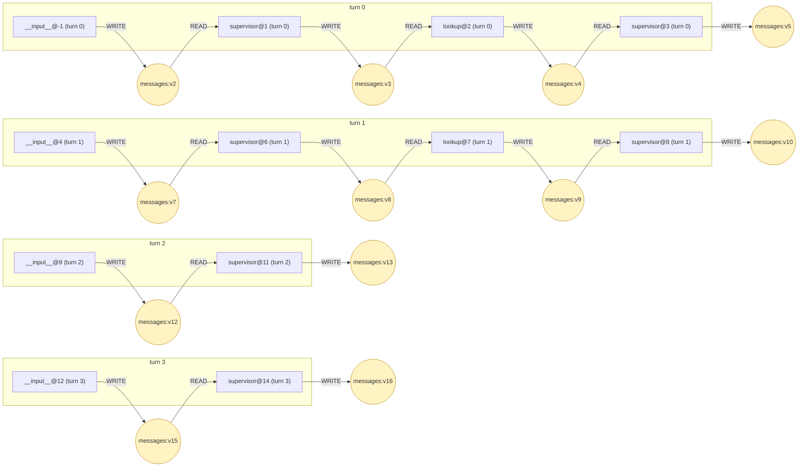
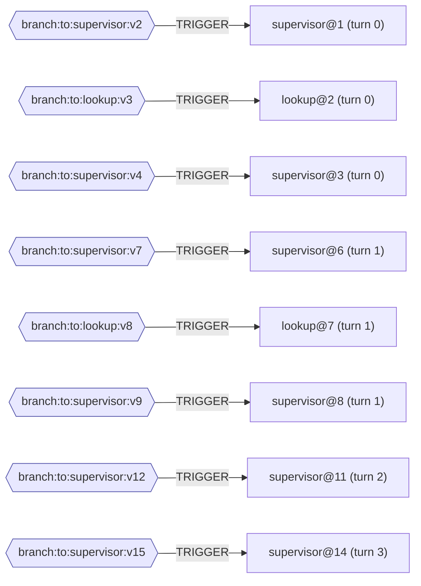

# Provenance — trace.jsonl

τ² task 0 · model openai · outcome PASSED · faults none

| | |
|---|---|
| Outcome | `PASSED` |
| Reward | `1.0` |
| DB score | `1.0` |
| Communicate score | `1.0` |
| Reasons | `-` |

Scored by the benchmark's evaluator. No task run or state version below is marked as the cause of this outcome.

12 task runs · 20 state versions · 20 WRITE · 8 READ · 8 TRIGGER · 11 DERIVED_FROM

Three relations, three pictures. They answer different questions, so they are not merged.

| diagram | relation | question |
|---|---|---|
| Data flow | `WRITE` / `READ` | which task produced the value another task was handed |
| State lineage | `DERIVED_FROM` | whether a later version of a channel still contains an earlier one |
| Control flow | `TRIGGER` | what caused each task to be scheduled |

## Data flow

Channels the data travelled on: `messages`. Both relations are **observed**: the write comes from the checkpoint's `pending_writes`, the read from the `channel_versions` of the checkpoint the task was scheduled from, intersected with the channels its recorded input carried.

## State lineage

A folding channel merges each write into the value rather than replacing it, which does **not** mean the new version contains the old one. Each link is checked against the element identities recorded per version: **11 verified, 0 refuted, 0 unverified**. Only verified links may be followed when tracing accumulation.

```mermaid
flowchart LR
  s_messages_v2(("messages:v2"))
  s_messages_v3(("messages:v3"))
  s_messages_v4(("messages:v4"))
  s_messages_v5(("messages:v5"))
  s_messages_v7(("messages:v7"))
  s_messages_v8(("messages:v8"))
  s_messages_v9(("messages:v9"))
  s_messages_v10(("messages:v10"))
  s_messages_v12(("messages:v12"))
  s_messages_v13(("messages:v13"))
  s_messages_v15(("messages:v15"))
  s_messages_v16(("messages:v16"))
  s_messages_v2 -. verified · kept 1 · +1 .-> s_messages_v3
  s_messages_v3 -. verified · kept 2 · +1 .-> s_messages_v4
  s_messages_v4 -. verified · kept 3 · +1 .-> s_messages_v5
  s_messages_v5 -. verified · kept 4 · +1 .-> s_messages_v7
  s_messages_v7 -. verified · kept 5 · +1 .-> s_messages_v8
  s_messages_v8 -. verified · kept 6 · +1 .-> s_messages_v9
  s_messages_v9 -. verified · kept 7 · +1 .-> s_messages_v10
  s_messages_v10 -. verified · kept 8 · +1 .-> s_messages_v12
  s_messages_v12 -. verified · kept 9 · +1 .-> s_messages_v13
  s_messages_v13 -. verified · kept 10 · +1 .-> s_messages_v15
  s_messages_v15 -. verified · kept 11 · +1 .-> s_messages_v16
  classDef state fill:#fff3c4,stroke:#b8860b;
  class s_messages_v2,s_messages_v3,s_messages_v4,s_messages_v5,s_messages_v7,s_messages_v8,s_messages_v9,s_messages_v10,s_messages_v12,s_messages_v13,s_messages_v15,s_messages_v16 state;
```

### What each step introduced

| version | produced by | new elements | preview of the write |
|---|---|---|---|
| `messages:v3` | `supervisor@1 (turn 0)` | 1 | To assist you, I need your user ID. Once I have that, I'll check the details of your reservation EHGLP3 and see if it's eligible for cancellation acco […] |
| `messages:v4` | `lookup@2 (turn 0)` | 1 | User X not found. Please verify the user ID and try again. |
| `messages:v5` | `supervisor@3 (turn 0)` | 1 | I couldn't find the user with the provided ID. Could you please confirm your user ID and try again? This is necessary to ensure we have the correct in […] |
| `messages:v7` | `__input__@4 (turn 1)` | 1 | [HumanMessage(content='Sure, my user ID is emma_kim_9957. Can you check that for me, please? Also, I was told by someone from your agency that I would […] |
| `messages:v8` | `supervisor@6 (turn 1)` | 1 | - |
| `messages:v9` | `lookup@7 (turn 1)` | 1 | Reservations for user emma_kim_9957: - EHGLP3: PHX->JFK 2024-05-17, cabin basic_economy, insurance no, upcoming - 66EEUA: ATL->MCO 2024-05-13->2024-05 […] |
| `messages:v10` | `supervisor@8 (turn 1)` | 1 | Based on the information retrieved, your reservation EHGLP3 is not eligible for cancellation because it is an upcoming reservation without travel insu […] |
| `messages:v12` | `__input__@9 (turn 2)` | 1 | [HumanMessage(content="I see. Unfortunately, I was told that I wouldn't need to get travel insurance for this trip because my previous booking with th […] |
| `messages:v13` | `supervisor@11 (turn 2)` | 1 | According to our records, your reservation MDCLVA does not include travel insurance. Without travel insurance, cancellations outside the 24-hour windo […] |
| `messages:v15` | `__input__@12 (turn 3)` | 1 | [HumanMessage(content="I understand the policy now. Since cancellation isn't possible without a refund, I'll keep my current reservation. Thank you fo […] |
| `messages:v16` | `supervisor@14 (turn 3)` | 1 | You're welcome! If you have any further questions or need assistance with anything else, feel free to reach out. Safe travels! |

`new elements` is the count of element ids present in this version and not in the previous one. It describes the step, not the input of whatever read this version next: a task is handed the whole version. Previews are truncated; the full text is in the trace.

## Control flow

Routing channels: `branch:to:lookup, branch:to:supervisor`. LangGraph stamps `versions_seen` only for a task's trigger channels, so in a `StateGraph` this records the routing channel and never the channel the data travelled on. That is why control and data are separate pictures rather than two edge types in one.

## Tool calls

A worker's tool loop runs inside one task, between that task's read and its write, so these calls appear in no checkpoint and are not nodes of the state graph. They are recorded facts all the same, and they are where a run reads or changes something outside LangGraph. Each is attached to its task through the checkpoint namespace LangGraph built for that task.

| task run | # | tool | arguments | effect | result |
|---|---|---|---|---|---|
| `lookup@2 (turn 0)` | 1 | `get_user_details` | user_id='X' | - | User X not found |
| `lookup@7 (turn 1)` | 1 | `get_user_details` | user_id='emma_kim_9957' | - | { "user_id": "emma_kim_9957", "name": { "first_name": "Emma", "last_na […] |
| `lookup@7 (turn 1)` | 2 | `get_reservation_details` | reservation_id='EHGLP3' | - | { "reservation_id": "EHGLP3", "user_id": "emma_kim_9957", "origin": "P […] |
| `lookup@7 (turn 1)` | 3 | `get_reservation_details` | reservation_id='66EEUA' | - | { "reservation_id": "66EEUA", "user_id": "emma_kim_9957", "origin": "A […] |
| `lookup@7 (turn 1)` | 4 | `get_reservation_details` | reservation_id='MDCLVA' | - | { "reservation_id": "MDCLVA", "user_id": "emma_kim_9957", "origin": "E […] |
| `lookup@7 (turn 1)` | 5 | `get_reservation_details` | reservation_id='H1QGCY' | - | { "reservation_id": "H1QGCY", "user_id": "emma_kim_9957", "origin": "L […] |

`external state mutation` marks the 0 call(s) whose tool was declared as one that changes state outside the process. It records what the call did, not that it caused the episode's outcome; an unmarked call is simply not on that list.

---

Every relation and the field it came from are in the `.provenance.txt` beside this file; the machine-readable form is in the `.provenance.json`.
