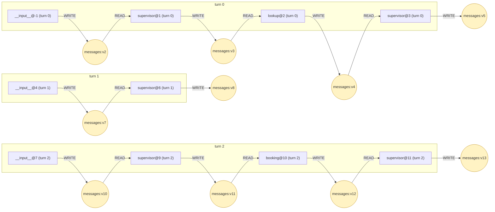
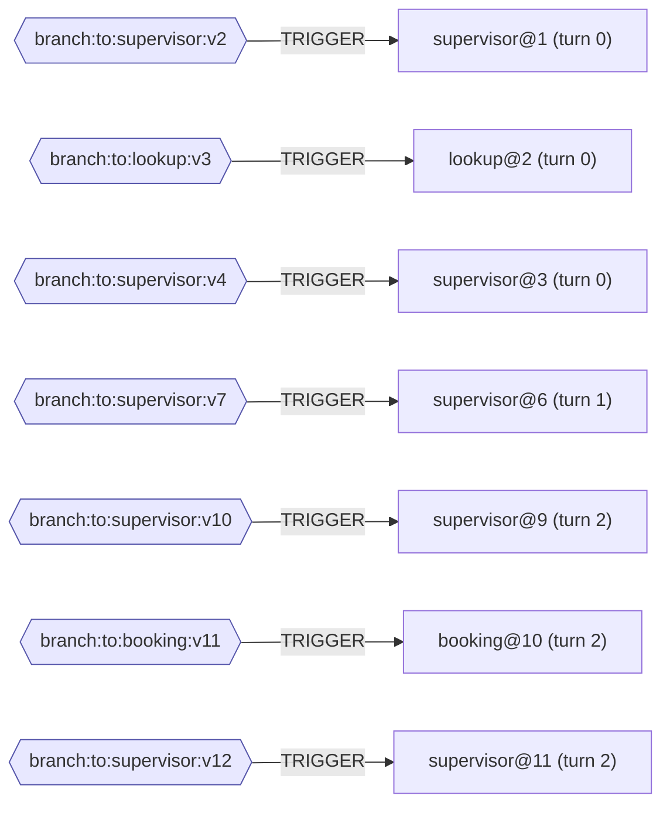

# Provenance — trace.jsonl

τ² task 1 · model openai · outcome FAILED · faults none

| | |
|---|---|
| Outcome | `FAILED` |
| Reward | `0.0` |
| DB score | `0.0` |
| Communicate score | `1.0` |
| Reasons | `db_state_mismatch` |

Scored by the benchmark's evaluator. No task run or state version below is marked as the cause of this outcome.

10 task runs · 17 state versions · 17 WRITE · 7 READ · 7 TRIGGER · 9 DERIVED_FROM

Three relations, three pictures. They answer different questions, so they are not merged.

| diagram | relation | question |
|---|---|---|
| Data flow | `WRITE` / `READ` | which task produced the value another task was handed |
| State lineage | `DERIVED_FROM` | whether a later version of a channel still contains an earlier one |
| Control flow | `TRIGGER` | what caused each task to be scheduled |

## Data flow

Channels the data travelled on: `messages`. Both relations are **observed**: the write comes from the checkpoint's `pending_writes`, the read from the `channel_versions` of the checkpoint the task was scheduled from, intersected with the channels its recorded input carried.

## State lineage

A folding channel merges each write into the value rather than replacing it, which does **not** mean the new version contains the old one. Each link is checked against the element identities recorded per version: **9 verified, 0 refuted, 0 unverified**. Only verified links may be followed when tracing accumulation.

```mermaid
flowchart LR
  s_messages_v2(("messages:v2"))
  s_messages_v3(("messages:v3"))
  s_messages_v4(("messages:v4"))
  s_messages_v5(("messages:v5"))
  s_messages_v7(("messages:v7"))
  s_messages_v8(("messages:v8"))
  s_messages_v10(("messages:v10"))
  s_messages_v11(("messages:v11"))
  s_messages_v12(("messages:v12"))
  s_messages_v13(("messages:v13"))
  s_messages_v2 -. verified · kept 1 · +1 .-> s_messages_v3
  s_messages_v3 -. verified · kept 2 · +1 .-> s_messages_v4
  s_messages_v4 -. verified · kept 3 · +1 .-> s_messages_v5
  s_messages_v5 -. verified · kept 4 · +1 .-> s_messages_v7
  s_messages_v7 -. verified · kept 5 · +1 .-> s_messages_v8
  s_messages_v8 -. verified · kept 6 · +1 .-> s_messages_v10
  s_messages_v10 -. verified · kept 7 · +1 .-> s_messages_v11
  s_messages_v11 -. verified · kept 8 · +1 .-> s_messages_v12
  s_messages_v12 -. verified · kept 9 · +1 .-> s_messages_v13
  classDef state fill:#fff3c4,stroke:#b8860b;
  class s_messages_v2,s_messages_v3,s_messages_v4,s_messages_v5,s_messages_v7,s_messages_v8,s_messages_v10,s_messages_v11,s_messages_v12,s_messages_v13 state;
```

### What each step introduced

| version | produced by | new elements | preview of the write |
|---|---|---|---|
| `messages:v3` | `supervisor@1 (turn 0)` | 1 | Of course, Raj. I can help you with that. Could you please provide me with the reservation ID for the flight from Philadelphia to LaGuardia that you w […] |
| `messages:v4` | `lookup@2 (turn 0)` | 1 | Reservations for user raj_sanchez_7340: - MZDDS4: MIA->LAX 2024-05-17, EWR->MIA 2024-05-23, cabin business, insurance no, upcoming - 60RX9E: MSP->EWR  […] |
| `messages:v5` | `supervisor@3 (turn 0)` | 1 | Based on the information retrieved, I see that you have several upcoming reservations. However, the reservation for the flight from Philadelphia to La […] |
| `messages:v7` | `__input__@4 (turn 1)` | 1 | [HumanMessage(content="Yes, I would like to proceed with the cancellation. However, I need to know if I will receive a refund for this cancellation. I […] |
| `messages:v8` | `supervisor@6 (turn 1)` | 1 | Thank you for your confirmation, Raj. Since the reservation was made within the last 24 hours, you are eligible for a refund. The refund will be proce […] |
| `messages:v10` | `__input__@7 (turn 2)` | 1 | Yes, I would like to proceed with the cancellation now that I know I'll be getting a refund. |
| `messages:v11` | `supervisor@9 (turn 2)` | 1 | - |
| `messages:v12` | `booking@10 (turn 2)` | 1 | เรียกใช้เครื่องมือ cancel_reservation สำหรับหมายเลขการจอง Q69X3R และการจองได้รับการยกเลิกแล้ว |
| `messages:v13` | `supervisor@11 (turn 2)` | 1 | Your reservation Q69X3R has been successfully cancelled. The refund will be processed to the original payment method used for the booking and will tak […] |

`new elements` is the count of element ids present in this version and not in the previous one. It describes the step, not the input of whatever read this version next: a task is handed the whole version. Previews are truncated; the full text is in the trace.

## Control flow

Routing channels: `branch:to:booking, branch:to:lookup, branch:to:supervisor`. LangGraph stamps `versions_seen` only for a task's trigger channels, so in a `StateGraph` this records the routing channel and never the channel the data travelled on. That is why control and data are separate pictures rather than two edge types in one.

## Tool calls

A worker's tool loop runs inside one task, between that task's read and its write, so these calls appear in no checkpoint and are not nodes of the state graph. They are recorded facts all the same, and they are where a run reads or changes something outside LangGraph. Each is attached to its task through the checkpoint namespace LangGraph built for that task.

| task run | # | tool | arguments | effect | result |
|---|---|---|---|---|---|
| `lookup@2 (turn 0)` | 1 | `get_user_details` | user_id='raj_sanchez_7340' | - | { "user_id": "raj_sanchez_7340", "name": { "first_name": "Raj", "last_ […] |
| `lookup@2 (turn 0)` | 2 | `get_reservation_details` | reservation_id='MZDDS4' | - | { "reservation_id": "MZDDS4", "user_id": "raj_sanchez_7340", "origin": […] |
| `lookup@2 (turn 0)` | 3 | `get_reservation_details` | reservation_id='60RX9E' | - | { "reservation_id": "60RX9E", "user_id": "raj_sanchez_7340", "origin": […] |
| `lookup@2 (turn 0)` | 4 | `get_reservation_details` | reservation_id='S5IK51' | - | { "reservation_id": "S5IK51", "user_id": "raj_sanchez_7340", "origin": […] |
| `lookup@2 (turn 0)` | 5 | `get_reservation_details` | reservation_id='OUEA45' | - | { "reservation_id": "OUEA45", "user_id": "raj_sanchez_7340", "origin": […] |
| `lookup@2 (turn 0)` | 6 | `get_reservation_details` | reservation_id='Q69X3R' | - | { "reservation_id": "Q69X3R", "user_id": "raj_sanchez_7340", "origin": […] |
| `booking@10 (turn 2)` | 1 | `cancel_reservation` | reservation_id='Q69X3R' | **external state mutation** | { "reservation_id": "Q69X3R", "user_id": "raj_sanchez_7340", "origin": […] |

`external state mutation` marks the 1 call(s) whose tool was declared as one that changes state outside the process. It records what the call did, not that it caused the episode's outcome; an unmarked call is simply not on that list.

---

Every relation and the field it came from are in the `.provenance.txt` beside this file; the machine-readable form is in the `.provenance.json`.
